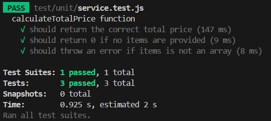

# POS Boilerplate
This is a boilerplate for a Point of Sale (POS) system. It provides a starting point for building a POS system using Next.js, Docker, and other technologies.

## Table of Contents

1. [Prerequisites](#prerequisites)
2. [Getting Started](#getting-started)
3. [Accessing the Server](#accessing-the-server)
4. [Using the Application](#using-the-application)

## Prerequisites

Before you begin, ensure you have met the following requirements:

- You have installed the latest version of [Docker](https://www.docker.com/get-started).
- You have a Windows/Linux/Mac machine with a recent version of [Node.js](https://nodejs.org/en/download/) and npm installed.

## Getting Started

To start the application, follow these steps:

1. Clone this repository.
2. Navigate to the project directory.
3. Run the following command to start the Docker container:

```bash
docker-compose up
```

This command will start all the services defined in docker-compose.yml.

## Accessing the Server

Once the server is up and running, you can access it at:
```
http://localhost:3000
```

For the database
```
http://localhost:8000
```

Use the following credentials to access into the database:
```
Username: admin
Password: password
```

## Using the Application

This section provides a step-by-step guide on how to use the application.

### Step 1: Selecting Items

First, choose the member and the menu items you want to order. For each menu item, specify the quantity you want to order.


### Step 2: Reviewing Your Order

After selecting items, you can review your order and the total price. 

Please note the following discount conditions:

- Members receive a 10% discount on their orders.
- Orders that include double quantities of the Orange, Pink, or Green sets receive a 5% discount.


### Step 3: Storing the Order

Once you've reviewed your order, you can submit it. The order will be stored in the database for record-keeping.


## Testing

This project uses Jest for testing. Tests are used to verify the correctness of the price calculation logic among other functionalities.

To run the tests, you need to have Node.js and npm installed on your machine. Once you have these installed, navigate to the project directory in your terminal and run the following command:

```
npm run test
```


